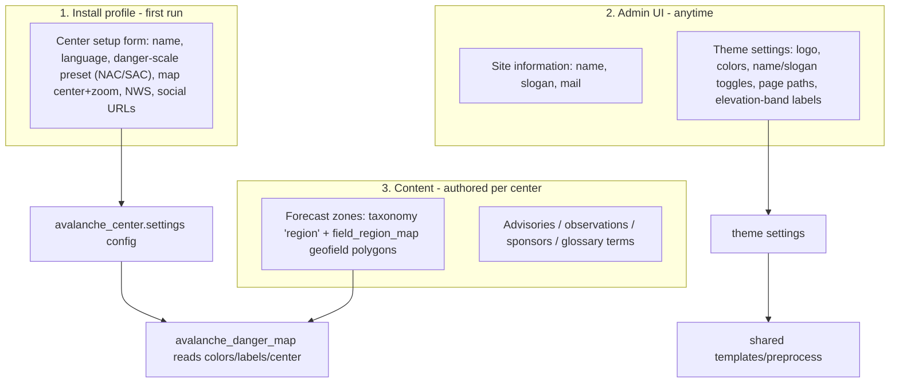

# Avalanche Center Distribution — Implementation Plan

> Goal: merge the Argentina and Gulmarg Backdrop CMS codebases into **one generic,
> installable "Avalanche Center" distribution** living in a single GitHub repo.
> Individual centers clone/install it anywhere (DDEV, Pantheon, other hosts) and
> supply their local specifics via an install-profile setup form, the Site
> Information section, and the modern theme's settings — no per-center code forks.
>
> Distribution model chosen: **generic GitHub distribution** (no Pantheon lock-in).
> Rollout strategy chosen: **greenfield-first** — build the distribution and
> validate it with a fresh demo install; migrate the two existing live sites
> (Argentina + Gulmarg) later as a separate, isolated phase.

This document is self-contained so it can be implemented in a fresh window/project.

---

## 1. Source codebases (reference paths)

- Argentina: `/home/andy/Siesta_Solutions/Argentina/backdrop/argentina-backdrop`
- Gulmarg:   `/home/andy/Siesta_Solutions/Gulmarg/backdrop/gulmarg-backdrop`

Both are Backdrop CMS (1.x) sites migrated from Drupal 7, already deployed to
Pantheon with a GitHub Actions pipeline. Backdrop docroot layout (files dir is
`files/`, active config in `files/config_active/`).

---

## 2. Why this is feasible (measured evidence)

The two codebases have already converged ~90%, because the Argentina migration
deliberately mirrored Gulmarg. Verified by inspection:

- **Contrib module lists are identical** (~33 modules in each `modules/` dir).
- **`danger_rose` module is byte-for-byte identical** between the two sites
  (`diff -rq` reports zero differing files).
- **`*_modern` theme `template.php`** is 236 lines in both and differs by **only
  8 lines** after normalizing the site name; the CSS file set is identical
  (`base.css, layout.css, components.css, advisory.css, observations.css, home.css`).
- **`responsive_sac`** differs only in 3 files: `logo.png`,
  `css/responsive_sac_sponsors.css`, `responsive_sac.info` — i.e. pure branding.
- **`*_modern` `.info`** already externalizes site-specifics as a **shared
  `settings[...]` schema** (same keys, different values).
- **`*_danger_map`** and **`*_glossary`** share structure; their divergence is
  *data* (danger color palette, labels, travel advice, map center, glossary
  terms) and *language*, not architecture.
- **`*_social_meta`** (a fourth site-prefixed custom module, `gulmarg_social_meta` /
  `argentina_social_meta` — not present when this doc was first written) follows
  the same pattern: identical `hook_token_info()`/`hook_tokens()` logic in both,
  differing only in the module-name prefix, one doc comment, and a per-site
  fallback logo filename. See §7 for the generic replacement.

Conclusion: the work is (a) rename-and-merge near-identical code, (b) move the
diverging *data* into config/settings, and (c) route hardcoded strings through
`t()` so language becomes a translation rather than a fork.

*(Minor packaging-only drift also found and not worth a code change: 7 contrib
modules — `conditional_fields`, `entity_token`, `field_collection`,
`leaflet_views`, `pathauto` (x2), `rules` — have looser `dependencies[]`
version constraints in Argentina's `.info` files than Gulmarg's. No version or
behavior differences; safe to ignore during merge.)*

---

## 3. Target repository architecture

Single repo `avalanche-center/` as a Backdrop distribution:

```
avalanche-center/
  profiles/avalanche_center/
    avalanche_center.info        # distribution: declares all module/theme deps
    avalanche_center.profile     # hook_install_tasks(): first-run "Center setup" form
    avalanche_center.install     # hook_install(): apply setup values to config + theme settings
    config/                      # SHARED STRUCTURAL config only (see section 5)
  modules/
    avalanche_danger_map/        # generic; reads scale + map center from config; ships NAC+SAC presets
    avalanche_glossary/          # generic; terms become content/config, strings via t()
    avalanche_social_meta/       # generic; replaces gulmarg_social_meta/argentina_social_meta token providers
    danger_rose/                 # shared as-is (already identical)
    (all contrib modules)        # shared as-is
  themes/
    avalanche_modern/            # generic base theme (was *_modern); branding via settings
    responsive_sac/              # shared; branding (logo/sponsors) via settings
    responsive_bartik/           # shared as-is
```

### Three layers inject everything site-specific (no code forks)



---

## 4. Backdrop install-profile mechanics (confirmed from docs)

- Install profile `<name>.info` declares `dependencies[]` and `type = profile`.
- `hook_install_tasks()` (in `<name>.profile` or `<name>.install`) adds custom
  installation steps; each task can be `type => 'form'` (collect user input) or
  `type => 'batch'`. Use this for the "Center setup" form.
- `hook_install_tasks_alter()` can replace the core `install_configure_form`.
- **Default config ships in a project's `config/` directory** and is moved to the
  live config dir via `config_install_default_config($project)`. Important: it
  **only creates new config, never overwrites existing** — so the profile's
  structural config is safe to ship.

---

## 5. Config classification (the largest single task)

There are ~1,649 active config JSON files (in `files/config_active/`). Each must
be sorted into two buckets:

### Structural — SHIP in `profiles/avalanche_center/config/` (identical across centers)
- Node types (corrected in Phase 1 — see §13 decisions log; original draft of
  this doc only listed `advisory`/`observation`, undercounting the real
  overlap): `advisory`, `observation`, `announcements`, `avalanche_education`,
  `banner_ad`, `class`, `events`, `feed`, `feed_item`, `fwp`, `media_gallery`,
  `page`, `people`, `simplenews`, `snowpack_summary`, `sponsor`,
  `week_in_review` (17 identical on both sites), plus `card` and `post`
  (Gulmarg-only, generic/reusable, folded into the baseline) and
  `custom_map`, `map`, `avalanche_watch` (folded in per Phase 1 decision,
  needs genericizing alongside `avalanche_danger_map` in Phase 3 — see §13).
  `nws_snow_observation` (Argentina-only, hardcoded to the US National
  Weather Service) is the one exception left site-specific, not shipped.
  Re-verified during the Phase 3 double-check: the union of every
  `node.type.*.json` across both reference sites is 24 files; excluding
  `nws_snow_observation` and a leftover `test` type (present on Gulmarg only,
  not a real content type) leaves exactly these 22.
- All `field.*` storage + instances, e.g. `field_overalldanger`,
  `field_forecast_region`, `field_region_map`, `field_snowpack_avalanche_weather`
- Taxonomy vocabularies: `region`, glossary vocabulary
- `views.view.*`: observations, advisory, recent-observations
- Image styles: `juicebox_multisize`, `juicebox_square_thumbnail`, `card`,
  `square_thumbnail`
- Text formats, roles/permissions, simplenews category *structure*, TB Megamenu
  *structure*

### Site-specific — DO NOT ship (set at install or authored per center)
- `system.site` (name, slogan, mail)
- All theme `settings` (branding, social URLs, page paths, elevation-band labels,
  NWS name/URL)
- Danger-scale preset choice + any color/label overrides
- Map center/zoom
- Menu links, the zone polygons, sponsors, glossary term content
- Per-center IDs embedded in `metatag.instance.node.*` (e.g. Gulmarg's
  advisory config sets `fb:app_id`; Argentina's has none) and the social-meta
  fallback logo filename

### Critical invariant
Field/vocabulary **machine names must be unified** across centers so shared views
and modules work. Argentina already mirrors Gulmarg's names, so this largely
holds.

Pick one canonical content model (recommend Gulmarg's English/NAC baseline).

*(Correction: an earlier version of this doc claimed Argentina and Gulmarg use
different observation submit paths — `/node/add/observation` vs.
`/node/add/snowobs`/`/node/add/avyobs`. Re-verified against current config:
**both sites define only a single unified `observation` content type**; every
live view/block link in both sites already points to `/node/add/observation`.
The `snowobs`/`avyobs` paths only survive as vestigial defaults in
`gulmarg_modern.info` and in `responsive_sac.info` **on both sites** — legacy
theme-setting values that 404 if followed, not a real routing split.

**Update: some reconciliation *is* needed**, beyond just dropping the stale
theme-setting defaults. Both sites' `user.role.7.json`/`user.role.9.json`
still grant dead permission strings (`"create snowobs content"`,
`"create avyobs content"`, `"edit own avyobs content"`, etc.) for node types
that no longer exist, and — more importantly — the **structural** views
`views.view.observations.json` and `views.view.Avalanche_LIst.json` (both
listed above as "ship as-is") still have `filters.type.value` arrays
containing `avyobs`/`snowobs` alongside `observation`. Harmless today (no
nodes of those types exist to match), but it's leftover cruft baked into
files this plan ships byte-for-byte as canonical structural config. **Strip
the dead `snowobs`/`avyobs` entries from these role and view filter configs
during the Phase 4/5 export**, rather than shipping them forward.

Separately, node-type sets diverge beyond `advisory`/`observation`: Gulmarg
has `card`, `custom_map`, `map`, `post` that Argentina lacks; Argentina has
`avalanche_watch`, `nws_snow_observation` that Gulmarg lacks. None of these
are claimed as structural, so this isn't a plan error, but Phase 1 (baseline
pick) should explicitly decide whether any of these per-site extra content
types are worth generalizing into the distribution or are left as
site-specific additions centers can add later.)*

---

## 6. Generic `avalanche_danger_map` module

Replaces `argentina_danger_map` + `gulmarg_danger_map`. Today the Argentina
version hardcodes the palette, Spanish labels, travel advice, legend PDF path,
and map center. Make all of that config-driven:

- **Ship two presets in code:**
  - `NAC` (North American), **canonical values from the official scale**
    (https://github.com/NationalAvalancheCenter/north-american-public-avalanche-danger-scale/blob/main/COLORS.md
    — re-fetched and re-verified during the Phase 3 double-check, from the
    canonical `NationalAvalancheCenter` org rather than a fork):
    `1=#50B848, 2=#FFF200, 3=#F7941E, 4=#ED1C24, 5=#231F20`. The official
    scale defines **only levels 1-5, no level 0**. Confirmed to match
    exactly what both `avalanche_danger_map` (module) and
    `avalanche_modern_danger_colors()` (theme) ship.
  - `SAC` (Argentine, from MapColor.php): `0=#CBCBCB, 1=#007F25, 2=#FFFD4B, 3=#FFA032, 4=#FF0013, 5=#000000`

*(Correction: an earlier version of this doc listed NAC as
`0=#cccccc, 1=#50b849, 2=#fff200, 3=#f7941d, 4=#ed1c24, 5=#231f20`. Re-verified
against the codebases: this was a hybrid that doesn't match either source
cleanly. The codebase actually contains **two independent, slightly divergent
hardcoded "NAC" palettes**: `gulmarg_danger_map.module`'s
`GULMARG_DANGER_COLORS` (`0=#cccccc, 1=#50b849, 2=#fff200, 3=#f7941d,
4=#ed1c24, 5=#000000` — off-by-one hex digits vs. the official scale on
levels 1/3, and wrong on level 5), and a **separate** copy hardcoded in the
theme layer, `gulmarg_modern_danger_colors()` / `argentina_modern_danger_colors()`
(`0=#939598, 1=#50b848, 2=#fff200, 3=#f7941e, 4=#ed1c24, 5=#231f20` — levels
1-5 match the official scale exactly). **Decision: use the official scale's
levels 1-5 above, sourced from the theme-layer copy since it's the one that's
actually correct; discard the module-layer copy's levels 1-5.** Level 0
("no rating"/grey) isn't part of the official NAC standard — it's a
site convention layered on top for the "ungraded" case, and the two existing
hardcoded copies disagree on its shade (`#cccccc` vs `#939598`). Pick one
(recommend `#939598`, since it sits alongside the otherwise-correct
theme-layer values) and expose it as an overridable config default rather
than treating it as part of the canonical palette.)*
- `config_get('avalanche_center.settings', 'danger_scale')` selects the preset;
  allow per-key overrides for colors / labels / travel-advice / legend PDF.
- Map `center` + `zoom` (currently hardcoded `[-41.13, -71.31]`, zoom `9`) read
  from config.
- **Fold in Argentina's PHP-8 fix**: the `hook_menu_alter()` that swaps
  `node_page_title` for a tolerant `*_node_page_title($node)` wrapper (loads the
  node when a raw nid string is passed). Gulmarg lacks this; make it the shared
  default.
- Route every display string through `t()` (so Spanish is a translation).
- Keep the existing data queries (`taxonomy_term_data` + `field_data_field_region_map`
  joined on vocabulary `region`; latest `advisory` per `field_forecast_region`
  via `field_overalldanger`). These rely on the unified machine names from §5.

---

## 7. Generic `avalanche_social_meta` module

Replaces `gulmarg_social_meta` + `argentina_social_meta` — **not present when
this plan was first drafted**; discovered on a later pass over the reference
codebases. Both are small token-provider modules (`hook_token_info()` +
`hook_tokens()`, no admin form, no `hook_html_head_alter()`) that feed the
contrib **Metatag** module's per-content-type config
(`metatag.instance.node.advisory.json`, `metatag.instance.node.observation.json`
— both structural, ship as-is per §5):

- Exposes two node tokens: `[node:overall-danger-icon]` (maps
  `field_overalldanger` to a static rating-icon file under
  `responsive_sac/img/rating-icons/200fb{N}.png`) and
  `[node:obs-image-for-social-media]` (falls back through
  `field_snowpack_avalanche_weather` → `field_ob_snowpit_photo` → a per-site
  logo file).
- The two sites' logic is otherwise identical; only the module-name prefix and
  the final logo-fallback filename (`gac_logo_white.jpg` vs. `ciap-logo-2.png`)
  differ.
- Genericize the same way as `avalanche_danger_map`: rename to
  `avalanche_social_meta`, read the fallback logo path from
  `avalanche_center.settings` config instead of hardcoding a filename, keep
  the rating-icon mapping (relies on the unified `field_overalldanger` machine
  name from §5).
- Gulmarg's advisory Metatag config also sets a hardcoded `fb:app_id`;
  Argentina's does not. Treat `fb:app_id` as site-specific (§5) — collect it
  optionally in the setup form rather than shipping it in structural config.

---

## 8. Generic theme `avalanche_modern` + shared `responsive_sac`

- Merge `*_modern` into one base theme `avalanche_modern`. The `template.php`
  delta is 8 lines — direct merge. Keep the shared `settings[...]` schema and
  ship **neutral English / NAC defaults**.
- Site branding (logo, colors, name/slogan toggles, page paths, elevation-band
  labels, NWS, social URLs) comes from **theme settings / the Header block**, not
  committed per-center assets.
- `responsive_sac` is shared; its only divergence is `logo.png`,
  `responsive_sac_sponsors.css`, and `responsive_sac.info` — drive those via
  settings instead of committed files.
- The existing `theme-settings.php` already exposes `toggle_name`,
  `toggle_slogan`, and `advisory_weather_expanded` GUI toggles — keep these.

### Shared `settings[...]` schema (already present in both `*_modern.info`)
`email_url, facebook_url, twitter_url, youtube_url, instagram_url,
upper_elevation_band, middle_elevation_band, lower_elevation_band,
enable_danger_rose_view, local_nws_name, local_nws_url,
current_wx_conditions_desc, show_forecast_region, wx_map_page, wx_table_page,
obs_page, submit_snowpack_obs_page, submit_avalanche_obs_page,
forecaster_name_field, map_first, toggle_name, toggle_slogan,
advisory_weather_expanded` (Gulmarg also has `wx_elevation_low/high`).

---

## 9. Install profile + setup form

- `avalanche_center.info`: `dependencies[]` for every contrib + custom module;
  `type = profile`.
- `avalanche_center.profile`: `hook_install_tasks()` adds a **"Center setup"**
  form step collecting: center name, language (en/es/...), danger-scale preset
  (NAC/SAC), map center + zoom, NWS name/URL, social URLs.
- `avalanche_center.install`: `hook_install()` writes those values into
  `avalanche_center.settings` config + theme settings. Structural config
  auto-imports from `config/` via `config_install_default_config()`.
- Ship a tiny **demo dataset** (one example forecast-zone polygon + one advisory)
  so a fresh install immediately renders a working danger map.

---

## 10. Internationalization

- Default to **English / NAC**.
- Route all hardcoded strings through `t()`.
- Ship an `es` `.po` translation so **Argentina becomes a locale + translation
  set, not a separate codebase**.
- Glossary terms become **editable content** (taxonomy/nodes), not code.

---

## 11. Phased implementation (greenfield-first)

| Phase | Work | Risk | Model |
|------|------|------|------|
| 1 | Repo skeleton + pick canonical baseline (English/NAC, sourced from Gulmarg); decide the leftover per-site content types and the level-0 grey shade (§6) | low | Opus |
| 2 | Genericize themes (`avalanche_modern`; `responsive_sac` branding-via-settings) | low | Sonnet |
| 3 | Genericize modules (`avalanche_danger_map` presets/config + PHP-8 fix + canonical NAC colors; `avalanche_glossary`; `avalanche_social_meta`; `t()` everywhere) | low-med | Opus |
| 4 | Classify config; reconcile machine-name/path exceptions; strip dead `snowobs`/`avyobs` entries from role/view config (§5) | med-high (biggest effort) | Opus |
| 5 | Export structural config into `profiles/avalanche_center/config/` | med | Sonnet |
| 6 | Build profile + setup form + `hook_install`; ship demo content | med | Sonnet |
| 7 | Greenfield validation: fresh DDEV install of a "demo" center end-to-end | med | Sonnet |
| 8 | (Separate, later) Migrate Argentina + Gulmarg onto the distribution by reconciling their config/content against the baseline | high | Opus |

### Model assignment rationale

- **Opus** for phases with ambiguous, judgment-heavy decisions where a wrong
  call is expensive to unwind: picking the canonical baseline and resolving
  conflicting hardcoded values (Phase 1, and the NAC-color reconciliation in
  Phase 3), and classifying ~1,650 config files into structural-vs-site-specific
  buckets while catching subtle cruft like the dead `snowobs`/`avyobs`
  references (Phase 4). Phase 8 (live-site migration) is the highest-risk
  phase in the whole plan and warrants the same care.
- **Sonnet** for phases that are mechanical once the Phase 1/3/4 decisions are
  made — theme/module renames following an already-diffed delta, config
  export, install-profile scaffolding, and iterative DDEV testing/debugging.
- **Fable** as an independent verification pass at the end of each phase
  (particularly after Phases 3, 4, and 6) — have it re-diff the actual
  codebases against whatever was just generated, the same way it caught the
  NAC-color and dead-permission-string issues in this plan review, rather
  than trusting the implementing model's own self-check.

---

## 12. Risks & decisions

- Backdrop has **no clean `config_split`** equivalent; the structural-vs-site
  classification (§5) is manual and is the main cost of the project.
- **Machine-name unification is mandatory** for shared views/modules — reconcile
  the path/field exceptions before exporting config.
- **Glossary terms and sponsors should be content**, not shipped code, so centers
  manage them in the UI.
- **Live-site migration (phase 8) is the riskiest step** and is intentionally
  deferred and isolated from the greenfield build.

---

## 13. Phase 1 decisions log

Phase 1 (repo skeleton + canonical baseline) is complete. Decisions made:

- **Canonical baseline confirmed**: English / NAC, Gulmarg content model
  (already locked in `CLAUDE.md` before this phase; re-confirmed here).
- **Node-type overlap was undercounted.** Re-diffing both sites'
  `node.type.*.json` found 17 identical node types beyond `advisory`/
  `observation` (see the corrected list in §5), not just the two originally
  documented. These are now structural.
- **Gulmarg-only `card` and `post`**: generic, reusable, no site-specific
  coupling (a page-embeddable card and a blog/news-post type) — folded into
  the structural baseline.
- **Gulmarg-only `custom_map` (`field_map_region`, `field_region_color`) and
  `map` (`field_map`, `body`)**: undocumented (`description` empty in
  source), but fields indicate `custom_map` feeds per-region shape/color data
  used by the danger map and `map` is a general embeddable-map page type —
  folded into the structural baseline. Genericize alongside
  `avalanche_danger_map` in Phase 3; confirm field usage against the module
  code at that point.
- **Argentina-only `avalanche_watch`**: SMN-specific label/description in
  source, but the underlying concept (a public avalanche watch/alert
  bulletin) generalizes to any center — folded into the structural baseline;
  genericize the SMN-specific copy through `t()` like everything else.
- **Argentina-only `nws_snow_observation`**: hardcoded to the US National
  Weather Service specifically (not just "a" weather service) — left
  site-specific, not shipped in `profiles/avalanche_center/config/`.
- **NAC level-0 ("no rating") grey**: no official value exists (the linked
  canonical scale only defines levels 1-5). Adopted `#939598` — the value
  already paired with the correct canonical 1-5 colors in the theme layer —
  as the shipped default, overridable per center.
- Created the repo skeleton (`profiles/avalanche_center/`, `modules/`,
  `themes/` per §3) with placeholder `.info`/`.profile`/`.install` files and
  README stubs marking what lands in each later phase.

---

## 14. Phase 2 decisions log

Phase 2 (genericize themes) is complete. `avalanche_modern` was merged from
`gulmarg_modern` (function/class prefixes, `t()`-wrapped labels and ~80
hardcoded UI strings in `node--advisory.tpl.php`/`advisory-node-form.tpl.php`,
canonical NAC colors from §6/§13 applied to `avalanche_modern_danger_colors()`).
`responsive_sac` and `responsive_bartik` were copied over with branding
(`logo.png`, `responsive_sac_sponsors.css`) and vestigial/non-portable files
stripped rather than adapted. Notable findings beyond straightforward renaming:

- **Vestigial `snowobs`/`avyobs` node-form templates and their `hook_theme()`
  registrations** (`avyobs_node_form`, `snowobs_node_form` in
  `responsive_sac/template.php`) were dropped, not just the templates —
  leaving the registration in place would have pointed at template files
  that no longer exist. Stale `/node/add/snowobs`/`/node/add/avyobs` example
  text in `theme-settings.php`'s form descriptions was also updated to
  `/node/add/observation`.
- **Instance-specific dead files identified and excluded**, not shipped:
  `page--node--5950.tpl.php` (hardcoded to one site's database node ID),
  `simplenews-newsletter-body--16.tpl.php` / `--108.tpl.php` /
  `rose-simplenews-newsletter-body--16.tpl.php` (Simplenews' `--[tid]`
  convention keys these to one site's auto-assigned taxonomy term ID, which
  won't match a fresh install), `page--old.tpl.php` (confirmed orphaned).
  The `views-view-row-rss--advisory-views--feed-1/2/3.tpl.php` templates
  were *kept* despite the similar-looking numeric suffix — that suffix is a
  Views *display machine name* on the structural `advisory_views` view, not
  a per-site data ID, so it's portable.
- **One real bug fix carried over from Argentina's copy, not a language
  difference**: `responsive_bartik/templates/block--menu.tpl.php` guards
  `$title_attributes` with `isset()` before use; Gulmarg's unguarded version
  can throw a PHP notice. Also applied the same defensive-guard pattern
  Argentina used in `node--advisory.tpl.php` for `$classes`/`$attributes`.
- **A theme-settings bug was introduced and then fixed during this phase**:
  `backgroung_header_img` / a center's header background image is stored as
  a Backdrop file ID (fid), not a path string. `page--advisory.tpl.php` and
  `page--snowpack-summary.tpl.php` called
  `file_create_url(file_load(theme_get_setting(...))->uri)` unconditionally;
  blanking the setting's shipped default (correct — no fid is portable
  across installs) meant `file_load('')` returns `FALSE` and `FALSE->uri`
  fatals. Both templates now guard the fid/file-load result before
  dereferencing `->uri`, falling back to an empty background.
- Dropped `img/gulmarg-light.png` from `responsive_sac` — confirmed
  unreferenced anywhere in the theme, a dead asset.

### Phase 2 remediation (found during a post-Phase-3 double-check)

The session that did Phase 2 was interrupted (battery died) partway through;
the interruption dropped an entire, separate body of work on the much
larger `responsive_sac` theme's advisory-related templates that the
original Phase 2 log above didn't cover (it only documented the smaller
`avalanche_modern` equivalents). A later double-check (prompted by the
user, who correctly remembered "this would take longer, there were so many
files") found and fixed:

- **`responsive_sac/inc/advisory.inc` had never been touched at all** —
  still raw D7-style field-array code, still had the same hardcoded
  Sierra-specific elevation-band-by-taxonomy-term-id table described in
  §6/§13's NAC-color writeup (a different bug, same "two divergent hardcoded
  copies" pattern), a hardcoded `sierraavalanchecenter.org` URL, and no
  `t()` wrapping. This file is live — `template.php` `require_once`s it for
  every `advisory` node — not dead code.
- **The elevation-band table design flaw existed in *both* themes' inc
  files**, including `avalanche_modern`'s already-"genericized" copy: it fixed
  the `field_forecast_region` field-name bug but kept the same
  per-taxonomy-term-id hardcoded table (with an English fallback). Both were
  fixed the same way: read `upper_elevation_band`/`middle_elevation_band`/
  `lower_elevation_band` from theme settings (already in the shared schema,
  §8) instead of a table keyed to Sierra Avalanche Center's own specific
  multi-zone region IDs, which doesn't generalize to any other center's
  region setup.
- **Vestigial `forecast` content-type templates were missed** —
  `node--forecast.tpl.php`, `node-forecast-edit.tpl.php`,
  `forecast-node-form.tpl.php`, and a live `forecast_node_form`
  `hook_theme()` registration (plus a dead duplicate comment block).
  Confirmed via `node.type.*.json` that `forecast` isn't a real content type
  on either reference site — same category of cruft as the `avyobs`/`snowobs`
  templates correctly dropped in the original Phase 2 pass, just missed for
  this one. Deleted.
- **`responsive_sac`'s two unprefixed global functions**
  (`_get_advisory_data()`, `_build_problem_html()`) were renamed/cleaned up:
  the first is now `responsive_sac_get_advisory_data()` (its one caller in
  `template.php` updated); the second was confirmed dead — unused in either
  reference site — and deleted rather than ported.
- **A full `t()`-wrapping pass** (delegated to a background Sonnet agent,
  independently verified after) across the 7 `responsive_sac` templates the
  original Phase 2 pass never reached: `node--advisory.tpl.php`,
  `advisory-node-form.tpl.php`, `node--snowpack_summary.tpl.php`,
  `snowpack-summary-node-form.tpl.php`, and the 3
  `views-view-row-rss--advisory-views--feed-*.tpl.php` templates. Found and
  fixed along the way:
  - A hardcoded personal message in `advisory-node-form.tpl.php`'s
    confirm-navigation-away dialog ("Don't do it Brandon! ...") — replaced
    with a generic, professional `t()`-wrapped message; the same
    unprofessional phrasing in `snowpack-summary-node-form.tpl.php` was
    also genericized.
  - Un-wrapped avalanche-problem-type description paragraphs (Storm Slab,
    Deep Slab, Wind Slab, etc.) duplicated three times in
    `node--snowpack_summary.tpl.php` — each element now individually
    wrapped in `t()`.
  - A copy/paste content bug in
    `views-view-row-rss--advisory-views--feed-1.tpl.php`: an
    advisory-only RSS feed template's "expires in" branch said "Snowpack
    Summary published on" — corrected to "Avalanche Advisory".
  - A hardcoded personal Twitter handle (`data-related="jasoncosta"`) in
    the social-share widget in both `node--snowpack_summary.tpl.php` and
    `node.tpl.php` — removed (no theme setting exists for a center's
    Twitter handle; dropping the optional attribute is safer than
    inventing a new config key for it).
- Cosmetic cleanup found in the same pass: `avalanche_modern.info`'s
  description no longer name-drops Sierra Avalanche Center by name; a
  duplicated form-field block in `responsive_sac/theme-settings.php` (same
  settings key defined twice, second silently overwriting the first) was
  collapsed to one, with its example text genericized; four SVGs under
  `responsive_sac/img/` had Inkscape `export-filename` metadata leaking the
  old dev server's hostname, stripped (verified still valid XML after).
- Re-verified the full `themes/` tree afterward: only doc-comment/README
  attributions to the original sites remain, no live code or user-facing
  strings.

---

## 15. Phase 3 decisions log

Phase 3 (genericize modules) is complete. `avalanche_danger_map`,
`avalanche_glossary`, and `avalanche_social_meta` were merged from their
`gulmarg_*`/`argentina_*` counterparts under `modules/`. Notable decisions
beyond straightforward renaming:

- **`avalanche_danger_map` presets are code, selection is config.** Both
  `NAC` and `SAC` palettes (§6/§13 canonical values) ship as PHP arrays in
  `avalanche_danger_map_presets()`; `config_get('avalanche_center.settings',
  'danger_scale')` picks one (default `NAC`), with optional per-key
  overrides (`danger_colors`, `danger_labels`, `danger_travel_advice`,
  `danger_legend_url`) for centers that need to deviate. Map `center`/`zoom`
  read from `map_center_lat`/`map_center_lng`/`map_zoom` config, falling
  back to `(0,0)`/zoom 2 if unset.
- **Labels and travel advice are single English source strings routed
  through `t()`** for both presets — Argentina's copy had hardcoded Spanish
  text directly in the module; that's now a translation-time concern (§10),
  not a second hardcoded copy. SAC only diverges on color values.
- **Folded in Argentina's PHP 8 `hook_menu_alter()` fix** (§6) as the
  unconditional shared default; Gulmarg's reference lacked it.
- **Found and fixed a real cross-preset bug while merging the legend**: both
  references picked legend-item text color by CSS `:nth-child` position
  (e.g. "the 2nd item is always yellow, always needs dark text"). That
  assumption breaks under a config-driven palette — a preset or override can
  put a light color in a position a different preset expects to be dark.
  Replaced with `avalanche_danger_map_contrast_color()`, which computes
  legibility from each color's actual luminance and applies it as an inline
  style, so the legend stays readable under any preset or override.
- **Standardized on the more complete of the two block behaviors**: Gulmarg's
  `hook_block_view()` never rendered the legend; Argentina's did. Generic
  module always appends the legend. Also adopted Argentina's richer map
  interaction values (420px height, 300px popup max-width, `fitBounds`
  padding) as the single shared behavior.
- **Legend link is config-driven, not a shipped asset**: NAC's preset
  defaults to the public avalanche.org scale reference URL; SAC ships no
  legend URL (Argentina's PDF was a site-specific asset, not shipped
  structurally) — a center can set `danger_legend_url` if it has one.
- **JS strings wrapped in `Backdrop.t()`** (`Danger Rating:`, `Travel
  Advice:`, `Read Full Advisory`, `Get more information`) so Backdrop's JS
  string extraction picks them up for the `.po` translation, consistent with
  the "route every display string through `t()`" rule extending to
  client-side strings.
- **`avalanche_glossary` drops Argentina's `/terminos-avalanchas` path**,
  keeping only the single English `/avalanche-terms` machine path (with its
  `%` callback variant) per §10 — Spanish is a translation of the page
  title/strings, not a second URL. Also dropped an unused `$term_url`
  variable found dead in Gulmarg's original (computed, never read).
- **`avalanche_social_meta`'s logo fallback is config, not a hardcoded
  filename** (§7): reads `avalanche_center.settings.social_fallback_logo`
  instead of choosing between `gac_logo_white.jpg` / `ciap-logo-2.png` in
  code; returns `NULL` gracefully (existing guard pattern) if unset or the
  file doesn't exist.
- Verified the module-layer NAC palette now matches the theme-layer palette
  from Phase 2 (`avalanche_modern_danger_colors()`) exactly — no more of the
  two-independent-copies divergence flagged in §6.

### Map-popup icon addition (post-Phase-3)

Added danger-level icons to the map popups (`avalanche_danger_map.js`/`.css`)
alongside the existing color-coded rating and travel advice, using resources
from the NAC's public repo
(https://github.com/NationalAvalancheCenter/north-american-public-avalanche-danger-scale).
That repo also holds the full danger-scale definition graphics and travel-
advice-only tables (not used here — our travel-advice text is already
correctly sourced in `avalanche_danger_map_presets()`).

- **Vendored the 6 SVG icons** ("With number" style: levels 1-5, plus the
  "Standard" No-Rating icon for level 0, which has no numbered variant) into
  `modules/avalanche_danger_map/icons/level-{0-5}.svg`. Verified by
  rendering them (via headless Chrome) that their baked-in colors match our
  canonical NAC palette exactly. **Note**: the upstream repo has no LICENSE
  file; its README frames it as intended for avalanche centers to reuse, but
  this wasn't independently confirmed with NAC before vendoring — worth
  following up if redistribution terms matter for a given deployment (see
  `icons/SOURCE.md`).
- **Found and fixed a pre-existing contrast bug while testing the popup
  visually**: the rating badge's text color was hardcoded white
  (`.danger-map-popup-rating { color: #fff }`), unlike the legend (which
  already used `avalanche_danger_map_contrast_color()` from the Phase 3
  work). Level 2 (bright yellow) with white text was nearly unreadable.
  Region data now carries a `text_color` field computed the same way as the
  legend, and the popup's inline style uses it (with `text-shadow`
  conditionally dropped for dark text, matching the legend's approach).
  Confirmed via an actual headless-Chrome screenshot, not just code review.
- Icon markup uses `height: 30px; width: auto` rather than fixed
  width+height — the six icons have different natural aspect ratios (levels
  0-2 are ~1:1, levels 4-5 widen to ~1.39:1 as more triangles stack in the
  design), so a fixed box would visibly stretch/squash some of them.

### Popup/legend redesign (post-Phase-3, second round)

- **Replaced the computed-luminance contrast rule with a fixed one, in both
  the legend and the popup**: white text on level 5 ("Extreme") only, black
  everywhere else. `avalanche_danger_map_contrast_color()` (the luminance
  function from the note above) is gone — it had a single remaining caller
  (the legend) once the popup switched to the fixed rule, and its own
  output didn't actually agree with the fixed rule on levels 3 and 5 (it
  put dark text on level 3's orange and light text was already right on 5,
  but a mockup built to demo the fixed rule got those two backwards by hand
  and only then was the real inconsistency between the two approaches
  caught). One rule, used in both places now, is simpler and matches what
  the shipped colors actually need.
- **Popup rating badge reformatted**: dropped `text-shadow`; text is now
  two lines, `LEVEL - LABEL` (bold, uppercase) over an `Avalanche Danger`
  caption, replacing the single-line "Danger Rating: **1 - Low**" string.
- **Level 0 ("No Rating") gets real travel advice**: "Insufficient data
  exists to issue a danger rating." with an inline "Get more information"
  link to the region's most recent advisory when `advisory_url` is
  available (falls back to plain text otherwise); the separate bottom
  "Read Full Advisory" link is suppressed for level 0 so the same link
  isn't shown twice.
- **Defensive borders added to both the legend segments and the popup
  rating badge**: level 5's near-black fill has no inherent edge, so on a
  dark surrounding background it can blend in completely. Doesn't affect
  the shipped light-themed site, but it's a one-line, no-downside fix,
  caught by actually rendering the components rather than only reading the
  CSS.

---

## 16. Phase 4: Config classification manifest

Phase 4 (classify config; reconcile machine-name/path exceptions; strip
dead `snowobs`/`avyobs` entries) is complete. Worked from the actual
active config on both reference sites (834 files on Gulmarg, 824 on
Argentina) rather than re-deriving §5's summary from memory, which
surfaced several corrections and a few genuinely new findings — this
phase earned its "biggest effort" billing. **This section documents
classification decisions; Phase 5 does the actual file copying.**

### Corrections to §5

- **All 9 taxonomy vocabularies are identical on both sites** and
  structural, not just `region` and the glossary vocab as originally
  written: `avalanche_terms`, `class_type`, `conditions_alerts`,
  `gallery_collections`, `newsletter`, `page_category`, `region`,
  `sponsor_level`, `tags`.
- **Field-set parity check across all 17 "identical" node types** (to
  catch hidden per-type divergence the way `fwp`'s field_collection setup
  first looked divergent — see below): only `advisory` actually differs,
  by exactly one field, `field_overall_danger_rose` (Gulmarg has it,
  Argentina doesn't). Traced its usage: it's **not dead** — both sites'
  shared `responsive_sac/templates/node--advisory.tpl.php` (byte-identical
  on both sites) unconditionally calls
  `field_view_field('node', $node, 'field_overall_danger_rose', ...)` at
  two points, and `gulmarg_modern`'s (→ `avalanche_modern`'s)
  `advisory-node-form.tpl.php` deliberately demotes it to a collapsed
  "Other fields (optional)" `$legacy_fields` section rather than removing
  it — a supported legacy field, not cruft. **Decision: fold into the
  canonical `advisory` bundle as structural** — Argentina's advisory pages
  are currently silently missing this display element (querying a
  nonexistent field returns nothing, no error); the distribution actually
  fixes that gap once Argentina migrates onto it (Phase 8).
- **`fwp` (Field Work Plan) is identical on both sites**, 13 fields
  including 4 `field_collection` fields (`field_destination_and_route`,
  `field_trip_members`, `field_vehicle_location_and_infor`,
  `field_responsible_party`) plus a nested field_collection
  (`field_emergency_contact`, attached both to `field_trip_members` items
  and directly to `user.user`). An initial name-only grep undercounted
  Gulmarg's fields and made this look divergent; the full field lists are
  identical. `field_collection` is already in `avalanche_center.info`'s
  dependencies from Phase 1 — no action needed beyond confirming Phase 5
  exports the field_collection_item bundle config alongside `fwp`'s.

### New discovery: dead config from disabled modules (exclude entirely)

Both sites' `system.extensions.json` show **Commerce and its ~15-20
submodules, and the `registration` module and its submodules, fully
disabled** (`false`) — yet their field/view config is still sitting in
active config, unshipped-cruft-style, same pattern as the `snowobs`/
`avyobs` permission strings but not previously noticed:

- All `field.field.commerce_*` / `field.instance.commerce_*` /
  `field.instance.*.commerce_discount*` etc. — dead, exclude.
- `views.view.donations.json` ("Donation Views") — dead, exclude.
- `views.view.attendees.json` (`base_table: registration`) — dead, exclude.
- `views.view.snowmobile_classes.json` and the
  `field.instance.*.registration.snowmobile_class` field — dead
  (registration-module-dependent), exclude.
- `views.view.ski_days.json` — fields include `field_price` and
  `field_buy_tickets_link` (paid-event ticketing tied to the same disabled
  commerce stack) — exclude.

### New discovery: legacy pre-Leaflet danger-map views (exclude entirely)

`gulmarg_danger_map.module`'s own docblock says it replaces "D7
OpenLayers map" — the old OpenLayers-based Views are still sitting in
active config, unused since the Leaflet-based custom module (now
genericized as `avalanche_danger_map`) took over and queries the database
directly rather than through Views:

- `views.view.danger_rating_map.json`,
  `views.view.danger_rating_map_ol_data_overlay.json` (Gulmarg),
  `views.view.ol_data_overlay_danger_ratings_.json` (Argentina's
  differently-named equivalent), `views.view.oldata.json` (Gulmarg) — all
  exclude.

### New discovery: other dead/personal views (exclude entirely)

- `views.view.clone_of_advisory_views.json` — human name literally "Clone
  of Advisory Views," duplicate of the real `advisory_views` — exclude.
- `views.view.andy_fwp.json` — human name "Andy FWP," a personal filtered
  view for one named staff member — exclude.

### Views needing behavioral reconciliation, not just a keep/exclude call

- **`views.view.observations.json`** (structural, per §5): 5 of its
  displays (`page_1`, `page_2`, `7_day_obs`, `page_4`, `page_5`) filter
  `type` on `{avyobs, observation, snowobs}`. Strip the two dead keys,
  keep `observation`.
- **`views.view.Avalanche_LIst.json`** ("Avalanche List" — "list of
  reported avalanches"): on **both** sites, all 4 displays
  (`default`, `page_1`, `views_data_export_1`, `views_data_export_2`)
  filter `type` on `avyobs`/`snowobs` **only** — unlike `observations`,
  there's no live `observation` entry alongside the dead ones. Shipping
  this "as-is minus the dead strings" would ship a view that returns zero
  rows forever. But the feature itself is fully reconstructible: the
  unified `observation` type has a
  `field_is_this_an_avalanche_obser` field (present, same name, on both
  sites) that is exactly the boolean distinguishing an avalanche
  observation from a general snow observation. **Recommendation: Phase 5
  should rewrite this view's `type` filter to
  `type = observation` plus a value filter on
  `field_is_this_an_avalanche_obser = Yes`, reviving the feature instead
  of either shipping it broken or deleting it.** Flagging rather than just
  doing it — this changes behavior, not just removes cruft, so it's worth
  a second look before Phase 5 executes it.

### Role permission cleanup — bigger than previously documented

§5/CLAUDE.md previously said only `user.role.7.json`
(Forecaster)/`user.role.9.json` (Program_manager) carry dead
`snowobs`/`avyobs` permission strings. Checked all 12 roles on both
sites — **9 of 12 are affected**, not 2:

| Role (same id/label both sites) | Dead perms |
|---|---|
| Administrator (3) | 16 |
| Admin (4) | 2 |
| Board_admin (5) | 10 |
| Board_member (6) | 0 (clean) |
| Forecaster (7) | 14 |
| Observer (8) | 12 |
| Program_manager (9) | 4 |
| Guide-educator (10) | 6 |
| administrator (core) | 0 (clean) |
| anonymous | 4 |
| authenticated | 8 |
| editor (core) | 0 (clean) |

Role machine-names and labels match exactly between Gulmarg and
Argentina, so Phase 5 can strip the same permission-string set uniformly
across both sites' role exports.

### Family-level classification rules

**Structural (ship as-is), inherited from parent bundle:**
`field.field.*`, `field.instance.*`, `field.bundle.*`,
`field_group.field_group.*` — structural when attached to one of the 22
canonical node types or the 9 canonical vocabularies; excluded when
attached to an excluded bundle (`nws_snow_observation`, the leftover
Gulmarg `test` type, or any of the dead commerce/registration bundles
above).

**Structural (core/module defaults, not site content):**
`image.style.*` (all 13 — the 4 named in §5 plus 9 standard core image
styles), `file.type.*` (all 5), `filter.format.*` (all 8),
`taxonomy.vocabulary.*` (all 9, corrected above), `views.settings`,
`views_ui.settings`, and the standard Backdrop/Views-module default views
(`admin_views_node`, `node_admin_content`, `user_admin`, `file_admin`,
`comments_recent`, `taxonomy_term`, `promoted`, `rules_scheduler`).

**Structural (tied to canonical content types):** `views.view.advisory_views`,
`views.view.observations` (post-strip), `views.view.Avalanche_LIst`
(post-reconstruction, see above), `views.view.banner_ads`,
`views.view.Education`, `views.view.events_upcoming`,
`views.view.field_work_plans`, `views.view.home_announcements`,
`views.view.image_library`, `views.view.media_gallery`,
`views.view.newsletter_articles`, `views.view.obs_by_author`,
`views.view.recent_content`, `views.view.week_in_review_views`,
`views.view.considerable_sponsors` ("Sponsors" — generic sponsor
listing, name is a red herring), `views.view.promoted_cards` (Gulmarg —
ties to the folded-in `card` type), `views.view.incidents` /
`views.view.All_Incidents` / `views.view.incidents_dump` (all filter
`type = observation`, i.e. incident-tagged observations, not a separate
content type — legitimate specialized admin/display views on canonical
content), `views.view.forecaster_tools` ("Tools for the annual report"),
`views.view.modify_content`, `views.view.advisory_dump`,
`views.view.advisory_board` (ties to `people`; human name says "People of
**SAC**" — genericize this description string during export),
`views.view.email_subscribers`. `metatag.instance.*` (all — global,
403/404, frontpage, node default, node.advisory, node.observation,
taxonomy_term, user, view — **except** strip the `fb:app_id` key
specifically from `metatag.instance.node.advisory.json`, per §5).
`layout.layout.default/node/admin_default` (standard scaffolding).
`menu.menu.main-menu/user-menu/management/navigation` (the 4 core
Backdrop menus).

**Site-specific (do not ship), family-wide:**
- `block.custom.*` — **all of it, on both sites** (spot-checked all 23
  Gulmarg titles: things like "Sierra Avalanche Center Newsletter", "Test
  donor form", "FS shield", "Disclaimer - Site owned by Non-Profit",
  "Scholarships" — every one is authored, center-specific content, not
  reusable structure).
- `layout.layout.home` / `layout.layout.dashboard` (Gulmarg has both,
  Argentina neither — each center's homepage block arrangement is exactly
  the kind of thing that should be set up per-center, not shipped).
- `menu.menu.menu-responsive-links` / `features` / `menu-contact` /
  `menu-doormat-menu` / `menu-archives` / `menu-about` — Gulmarg-specific
  site navigation structure, not core menus.
- Confirmed site-specific among the `*.settings` singletons:
  `gulmarg_modern.settings.json` / `responsive_sac.settings.json` (theme
  settings storage — matches §5's existing "all theme settings" rule
  exactly) and, newly confirmed by reading the file,
  `simplenews.settings.json` (`from_address` and `from_name` are literally
  `Gulmarg Avalanche Center`-specific, not a generic default).

**Verified safe, no secrets present:** spot-checked `geocoder.settings`
and `leaflet_more_maps.settings` (both have every API-key field blank) —
safe to ship as generic empty defaults rather than needing exclusion for
credential-leak reasons.

### Still needs a closer look before Phase 5 executes the export

This phase covered the highest-value/highest-risk ground (the parts most
likely to hide bugs or leak site identity) but didn't individually audit
every one of the ~29 remaining `*.settings` singletons for a stray
site-specific value the way `simplenews.settings` turned out to have one
— Phase 5 should spot-check each on both sites before copying, not just
trust the "probably a generic module default" assumption this section
made for time's sake.

---

## 17. Phase 5 decisions log

Phase 5 (export structural config into `profiles/avalanche_center/config/`)
is complete: 659 files exported, sourced from Gulmarg by default (Argentina
only for `avalanche_watch`'s own bundle), per Phase 4's classification. The
mechanical copy itself was the easy part; verifying what got copied kept
surfacing the same category of problem Phase 4 had already found once
(hardcoded site identity, stale module-name references) in places a
classification pass alone couldn't have caught — only actually reading the
exported file contents did.

### Genericized site-specific default values found via a keyword sweep

A sweep of the exported files for site names/domains turned up default
values, labels, and descriptions baked into otherwise-structural fields
that Phase 4's classification (which worked at the family/file level) had
no way to catch:

- `field.instance.node.advisory.field_disclaimer` — default value was a
  full Gulmarg/Jammu-Kashmir-specific disclaimer paragraph. Blanked.
- `field.instance.node.advisory.field_mountain_weather` — default value
  was a Gulmarg-specific snow-forecast.com embed. Blanked.
- `field.instance.node.banner_ad.body` — default value and description's
  example both linked to `sierraavalanchecenter.org/donate`. Blanked/
  genericized.
- `field.instance.node.events.field_buy_tickets_link` — default value
  pointed at the same donate URL. Blanked.
- `field.instance.node.observation.field_published_ob` /
  `field_share_this_observation_` — labels named "Gulmarg Avalanche
  Center" directly. Genericized.
- `field.instance.node.events.body` / `node.type.events` — description
  said "Events for the Sierra Avalanche Center". Genericized.
- `field.instance.user.user.field__company_link` — default value linked
  to `sierraavalanchecenter.org`. Blanked.
- **Two fields had entire site-specific *allowed-values lists* baked into
  field storage**, not just a default: `field.field.field_region`
  (observation) had `{Gulmarg: Gulmarg, Other: Other}` — Argentina's own
  copy has a completely different, non-overlapping list
  (`{Outside of the Forecast Area: ...}`), confirming this data is
  inherently non-portable. `field.field.field__locations`
  (avalanche_education) had a hardcoded list of Sierra-region place names
  (Donner Summit, Mt. Rose, Lake Tahoe, etc.). Both replaced with a
  minimal generic default (`{Other: Other}` / `{Online: Online, Other:
  Other}`) — centers add their own real options via Field UI after
  install, the same way any Field UI list field normally works.
- **View page titles and embedded HTML content**, not just field
  defaults: `views.view.advisory_views`, `observations`, `incidents`,
  `All_Incidents`, `Education`, `forecaster_tools`, and `advisory_board`
  all had "Gulmarg Avalanche Center" / "Sierra Avalanche Center" / "Lake
  Tahoe" / "Central Sierra" baked directly into display titles and block
  body text. Genericized all of them.
- `views.view.observations`'s `page_5` display had an exposed filter
  restricting `field_region_value` to `{all, Gulmarg, Other}` — updated to
  match the genericized field (dropped the now-nonexistent `Gulmarg` key).

### Found and fixed: a config-driven value that was fetched but ignored

`views.view.advisory_views.json` has a large embedded PHP output field
(a legacy alternate advisory renderer, likely for an RSS/newsletter
context) that correctly fetches `$nws_name =
theme_get_setting('local_nws_name')` — and then hardcodes `>Reno NWS<`
in the actual link text instead of using the variable it just fetched.
Fixed to print `$nws_name`, the same bug-shaped issue as the
theme-settings work in Phase 2 (compute the config-driven value, then
actually use it).

### Found and fixed: stale references to pre-genericization module/machine names

Phase 3 renamed `gulmarg_danger_map` → `avalanche_danger_map` and its
Leaflet map definition `gulmarg_topo_satellite` →
`avalanche_topo_satellite`, but those old names were still baked into
config that Phase 3 didn't touch (it only edited the module's own PHP/JS/CSS
files, not other config referencing it by name):

- `layout.layout.node.json` placed a block via
  `"plugin": "gulmarg_danger_map:danger_map"` — would have silently failed
  to render (referencing a module name that no longer exists in this
  distribution). Fixed to `avalanche_danger_map:danger_map`.
- `field.instance.node.observation.field_location`'s map-display
  formatter, and two views (`incidents`, `observations`) each had two
  embedded leaflet-map blocks referencing `gulmarg_topo_satellite` by
  name. All four updated to `avalanche_topo_satellite`.
- The same observation field's widget also hardcoded Gulmarg's own
  lat/lng (34.03, 74.35) as the default map center for the "where did you
  make this observation" location picker. Neutralized to (0, 0).

### Found: 8 more disabled modules beyond Commerce/registration (Phase 4 only caught those two)

Cross-referencing every exported `field.field`/`field.instance`'s
`module` key against `system.extensions.json`'s enabled/disabled state
(the authoritative signal — DB-mirrored, unlike most config) turned up
`gmap_polygon_field`, `emfield`, `hs_taxonomy`, `media`,
`openlayers_geofield`, `select_or_other`, and `term_reference_tree` all
disabled on both sites, none present in either codebase's `modules/`
directory. Distinguished by severity:

- **One field-type-level break** (the worse kind — the field can't exist
  at all without the module): `field.field.field_map` (the `map` content
  type's core field) is typed `gmap_polygon_field`. Left in the export
  as-is rather than guessing a fix, and flagged prominently (config
  `README.md`, this log) — `map` needs a real decision (convert the field
  to `geofield`, or drop the content type) before it's usable. Not
  resolved this phase.
- **Ten widget-level breaks** (the field's actual storage type is fine —
  a live, working module; only the data-entry widget referenced a
  disabled one) — fixed by swapping to a safe, already-a-dependency
  fallback widget: `field_forecast_region` (advisory + snowpack_summary)
  and `field_conditions_alerts_tax_term` (observation) from
  `hs_taxonomy`/`term_reference_tree` to `options_select`;
  `media_gallery_file` and `field_snowpack_avalanche_wx_vids` from
  `media`/`emfield` to the standard `file_generic` widget;
  `custom_map`'s `field_map_region` from `openlayers_geofield` to
  `leaflet_widget_widget` (consistent with how `field_location` already
  does it); five `select_or_other` text fields (`field_clothing`,
  `field_travel_method`, `field_elevation_of_observation`,
  `field_starting_elevation`, `field_trigger`) to plain `text_textfield`,
  preserving their curated option lists as a "Suggestions: ..." addition
  to the field description rather than silently losing them.
- **One enabled-but-code-missing module**: `email` (used by
  `field_email` on `observation`) is marked enabled in both sites'
  `system.extensions.json` but its code isn't in either codebase. Added
  to `avalanche_center.info` dependencies with a note to source it from
  backdropcms.org before install, rather than treating it as dead (it's
  not disabled — someone just didn't commit the module).

### Excluded

- `field.instance.node.class.field_register` — widget module
  `registration`, `active: 0`; the whole field is unusable without the
  disabled `registration` module. Excluded from the `class` bundle's
  export (the `class` type itself is otherwise fine).
- `views.view.Avalanche_LIst` — **deliberately not exported this phase.**
  Per §16, all 4 displays filter on the dead `avyobs`/`snowobs` types with
  no live fallback, and the fix isn't a simple JSON edit — reconstructing
  it properly means rebuilding its filter against
  `field_is_this_an_avalanche_obser` using the Views UI, where the result
  can actually be tested against a running site. That needs a live
  Backdrop instance (Phase 7's greenfield DDEV install), not a hand-edited
  JSON patch nobody can verify runs correctly. Tracked here so it isn't
  forgotten before Phase 7.

---

## 18. Phase 6 decisions log

Phase 6 (build the profile + setup form + `hook_install`; ship demo
content) is complete: `avalanche_center.profile` implements
`hook_install_tasks()` with the "Center setup" form §9 specifies, and
`avalanche_center.install` seeds fallback defaults plus a demo forecast
zone + advisory. Couldn't runtime-test any of this against a live
Backdrop instance (no DDEV environment exists yet — that's Phase 7), so
everything below was verified by reading Backdrop core's actual function
signatures rather than by running it.

### Found: §9's hook_install() ordering doesn't work as originally written

§9 said `hook_install()` writes the setup form's values into
`avalanche_center.settings` + theme settings. Checked Backdrop's actual
install task order (`install.core.inc`): `hook_install()` fires while the
profile's dependencies are being installed, which happens *before*
`hook_install_tasks()`'s custom tasks (including our form) are ever shown
to the user. `hook_install()` genuinely cannot access values from a form
that hasn't been submitted yet. Resolved by moving the value-writing to
the setup form's own submit handler (`avalanche_center_setup_form_submit()`
in `.profile`) — the actual first point in the install where those values
exist — and narrowing `hook_install()` (in `.install`) to just seeding
safe fallback defaults, for the edge case of a scripted/automated install
that skips interactive `install_state` tasks entirely.

### Found: demo-content creation needed the real Entity API, not stdClass

Backdrop type-hints its save functions against actual entity classes:
`taxonomy_term_save(TaxonomyTerm $term)` and `node_save(Node $node)` (and
`node_object_prepare(Node $node)`) all reject a plain `stdClass` — a
TypeError, not a silent failure, but only caught by actually reading the
function signatures in core, since there's no live site yet to catch it
by testing. Used `entity_create('taxonomy_term', array('vocabulary' =>
'region'))` / `entity_create('node', array('type' => 'advisory'))`
instead, which return the correctly-typed objects. Confirmed
`TaxonomyTerm`'s bundle key is `vocabulary` from `taxonomy_entity_info()`'s
`'bundle keys'` — a `generate-d7-content.sh` script under Backdrop core's
own `scripts/` uses `vocabulary_machine_name` for the same purpose, but
that appears to be a stale leftover from Drupal 7's numeric-vid days, not
the current API; didn't follow it.

### Found: geofield's presave hook reads `geom`, not `wkt`

The demo forecast-zone polygon is set via
`$term->field_region_map[LANGUAGE_NONE][0][...]`. Initially used a `wkt`
key (matching the widget type name, `geofield_wkt`), but
`geofield_field_presave()` (in `geofield.module`) only ever reads
`$item['geom']` — passing a WKT string under that key works fine since
`geoPHP::load()` auto-detects the format; the widget name and the storage
key aren't the same thing. Using `wkt` would have silently created a term
with empty/null geometry — no error, just a forecast zone with nothing to
draw on the map. Caught by reading `geofield_field_presave()`'s source
directly, not by testing.

### Design notes

- Demo geometry is a small square (~±0.05° ≈ 5.5km) built with `sprintf()`
  + `geoPHP::load()`, centered on whatever `map_center_lat`/`map_center_lng`
  the setup form collected — so the demo zone is at least in the right
  place for the center being set up, not hardcoded to any reference site's
  coordinates.
- Theme settings get written to **both** shipped themes
  (`avalanche_modern` and `responsive_sac`), not just whichever ends up
  default, so switching themes later doesn't land on a blank settings
  page.
- The demo advisory only fills the fields required to make it useful
  (`field_forecast_region`, `field_overalldanger`, the three elevation-band
  `field_danger_rating_*`, `field_duration`, `field_bottom_line`) —
  `field_simplenews_term` is schema-required but left empty; Backdrop's
  `required` flag is a form-validation constraint, not enforced by
  `node_save()` called directly in code, and there's no newsletter term to
  reference yet on a fresh install anyway.

### Known gaps, not addressed this phase

- **No ongoing admin settings form** — the setup form only runs once,
  during install. Changing the danger-scale preset, map center, or the
  social-meta fallback logo (`avalanche_center.settings.social_fallback_logo`,
  §7) afterward currently has no admin UI; would need a proper
  `hook_menu()` settings page. Not in §9's scope, but worth a future phase.
- **`social_fallback_logo` isn't collected at install** — it's a file
  upload (a `managed_file` widget, needing actual file-save handling
  during form processing), not a simple textfield, and §9's setup-form
  field list doesn't call for it. Left as a config value with no default,
  same "no logo shipped" behavior `avalanche_social_meta` already handles
  gracefully (falls back to `NULL`).
- **Language selection is collected but not yet functional** — no `.po`
  translation exists yet (§10), and `locale` isn't a declared dependency.
  Selecting "Spanish" currently just records the preference in
  `avalanche_center.settings.language`; the interface stays in English
  until a later phase adds real locale support.
- **None of this has run against a live Backdrop instance.** Every fix in
  this log came from reading core source, not from a stack trace. Phase 7
  (greenfield DDEV install) is where this actually gets exercised for the
  first time — treat this phase's code as unverified until then.

---

## 19. Reference: key files to study in the source codebases

- Theme settings GUI: `themes/argentina_modern/theme-settings.php`
- Shared settings schema: `themes/argentina_modern/argentina_modern.info`
  vs `themes/gulmarg_modern/gulmarg_modern.info`
- Danger map to genericize: `modules/argentina_danger_map/argentina_danger_map.module`
  and `modules/gulmarg_danger_map/gulmarg_danger_map.module`
- Glossary to genericize: `modules/argentina_glossary/` and `modules/gulmarg_glossary/`
- Social meta tokens to genericize: `modules/argentina_social_meta/argentina_social_meta.module`
  and `modules/gulmarg_social_meta/gulmarg_social_meta.module`
- Already-shared module: `modules/danger_rose/` (identical both sites)
- Shared theme: `themes/responsive_sac/` (only logo/sponsors/.info differ)
- Active config to classify: `files/config_active/*.json`
